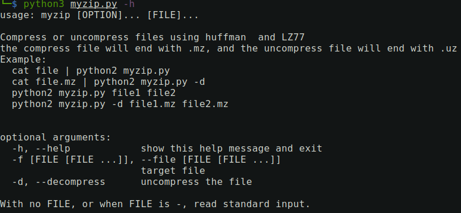
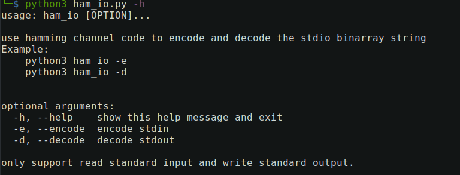

<!--
 * @Author: Samrito
 * @Date: 2021-12-13 14:13:17
 * @LastEditors: Samrito
 * @LastEditTime: 2022-02-28 21:29:58
-->
# Information_Theory_Lab

## Lab1 SourceCode
- huffman编解码实现
- lz77编解码实现
- huffman与lz77对标准输入输出流支持
- CLI交互集成

## Lab2 ChanelCode
- 汉明码实现
- CLI交互

